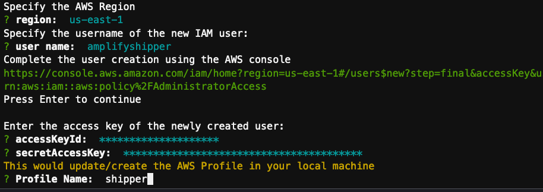
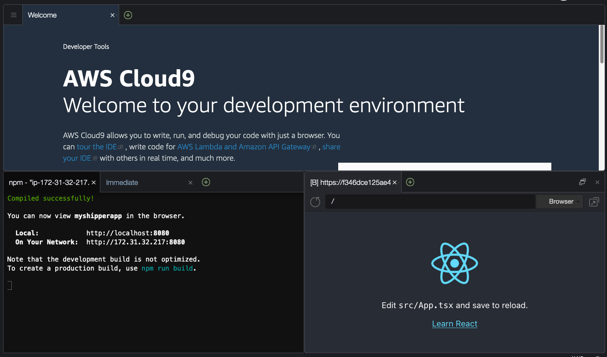
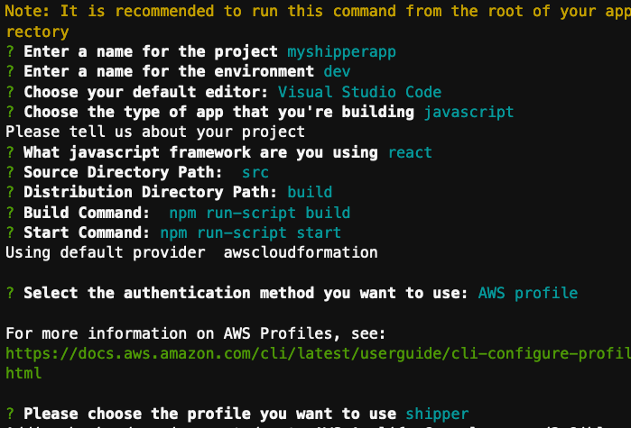
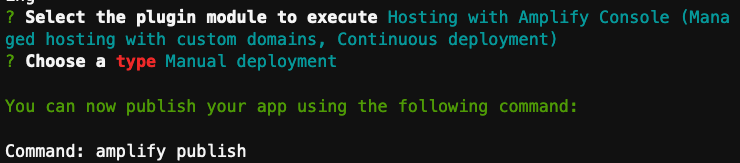
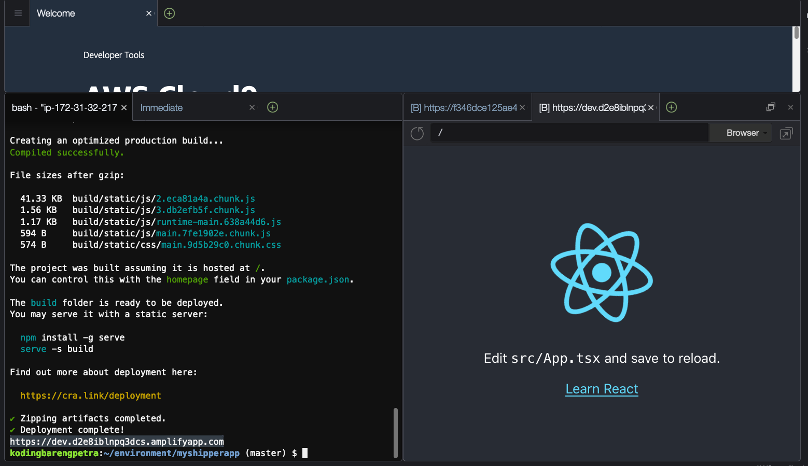
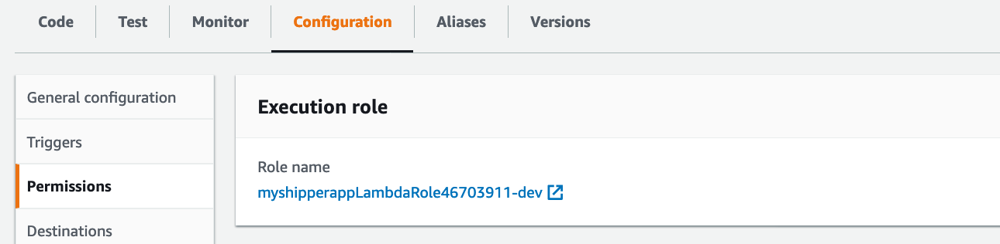

# Building Application using React, Shipper API, AWS Amplify, and Amazon Location Service

Hi everyone, in this tutorial we are going to build a very simple application by using React, 
Shipper API, AWS Amplify, and Amazon Location Service. The application will do a simple API 
call from Shipper API and show in the map.

## 0. Set Up Cloud9 IDE

AWS Cloud9 is a cloud-based integrated development environment (IDE) that lets you write, run, and debug your code with just a browser.
We will use AWS Cloud9 for development to make it easy for us to get standardized environment and easy collaboration.

### 0.1. Set Up Cloud9

**STEP 1** Open .

**STEP 2** Click **Create Environment**.

**STEP 3** Put name for the new Environment, e.g. "ShipperApp". Click **Next Step**.

**STEP 4** Leave all default options, except size. Choose `m5.large`. Click **Next Step**.

**STEP 5** In the review page, click **Create environment**.

## 1. Installation

In this step we will do installation of required libraries and components for development.


### 1.1. Install AWS Amplify.

We will assume that we will use Linux-based IDE (e.g. AWS Cloud9).

**STEP 1** Install AWS Amplify using Node Package Manager (NPM).

```bash
npm install -g @aws-amplify/cli
```

To test whether the installation successful, execute the step below.

```bash
amplify --version
```

**STEP 2** Now we need to configure AWS Amplify so that it can access/create AWS resources on our behalf.

```bash
amplify configure
```

**STEP 3** Follow the steps. Starting by accessing AWS console. .

```
Follow these steps to set up access to your AWS account:

Sign in to your AWS administrator account:
https://console.aws.amazon.com/
Press Enter to continue
```

**STEP 4** Choose `us-east-1` for **region** configuration.

**STEP 5** Input username for IAM user, you can leave blank, or you can choose your own, e.g. `amplifyshipper`. After you input, it will show a URL. Follow the URL to create.

**STEP 6** Make sure the IAM panel shows the right username you choose, and "Programmatic Access is checked". Click **Next: Permissions**.

**STEP 7** Make sure the permission is "Administrative Access". Click **Next: Tags**.

**STEP 8** Leave default. Click **Next: Review**.

**STEP 9** Review the choices. Click **Create User**.

**STEP 10** The panel will show Access Key ID and Secret Access Key. Download the CSV.

**STEP 11** Go back to terminal, it will prompt "Enter the access key of the newly created user". Input the access key and secret access key.

**STEP 12** In the profile name, input `shipper`.

.

## 2. Development

Now we are arrive in the fun part!

### 2.1. Create a fresh React Project.

**STEP 1** To create a new React project, execute the command below. We assume the project name is `myshipperapp`.

```bash
npx create-react-app myshipperapp --template typescript
```

**STEP 2** Let's test the app.

```bash
cd myshipperapp
npm start
```

When you see something like this below, you can open the app in your browser with URL: `https://localhost:8080`.
Or you can also see the preview in Cloud9 by choosing **Preview** > **Preview Running Application**.

```text
Compiled successfully!

You can now view myshipperapp in the browser.

  Local:            http://localhost:8080
  On Your Network:  http://172.31.32.217:8080

Note that the development build is not optimized.
To create a production build, use npm run build.
```

.

**STEP 3** Install required libraries.

```bash
npm install aws-amplify @aws-amplify/ui-react
```

### 2.2. Initialize Backend.

Now to get backend services, we need to initialize the backend support.

**STEP 1** From the root of the project, execute 

```bash
amplify init
```

It will then ask you to specify some of configuration. Choose the default values like below.

.

Then it will run CloudFormation 

### 2.3. Deploying Application

Now we are going to deploy our simple application using Amplify.

**STEP 1** Execute command below

```
amplify add hosting
```

**STEP 2** Choose "Hosting with Amplify Console".

**STEP 3** Choose "Manual deployment" on the deployment type.

.

**STEP 4** Now everytime you want to deploy, you deploy using command

```bash
amplify publish
```

It will show something like this

.

Your can see your URL in the bottom of the output, e.g. `https://dev.d2xxxxxxxxx.amplifyapp.com`.

**STEP 5** Open the URL to see the application.

.

Now you can see the result of your application.


### 2.4. Adding Authentication.

Now we are going to add authentication so our application can call AWS services on our behalf.

**STEP 1** Execute the command below.

```bash
amplify add auth
```

**STEP 2** Choose `default configuration`. In your own application you can choose if your application want to connect using Social Provider e.g. Facebook.

**STEP 3** Choose `username`. In your own application, you can also choose with email.

**STEP 4** Choose `No, I am done`.

**STEP 5** Execute command below to push the changes and create required AWS resources.

```bash
amplify push
```

Choose `Y` when prompted. Wait until message `✔ All resources are updated in the cloud` displayed.

**STEP 6** Execute command below to publish the application.

```bash
amplify publish
```

Wait until message `✔ Deployment complete!`.

### 2.5. Storing Shipper API Key and configuration.

In this step we will need to store Shipper API key and Base URL configuration safely in AWS Parameter Store.

**STEP 1** Open . You will see API key and Base URL. Copy those two values.

**STEP 2** Open .

**STEP 3** Click **Create Parameter**.

**STEP 4** In the **Create Parameter** panel, store a new parameter with configuration below (leave other default). And then click **Create parameter**.
- Name: `SHIPPER_API_KEY`
- Value: <your shipper api key>

**STEP 5** Create a new parameter, this time with below configuration.
- Name: `SHIPPER_API_BASE_URL`
- Value: <your shipper API base url, e.g. `https://api.sandbox.shipper.id/`>

### 2.6. Create Location Dropdown chooser.

#### 2.6.1. Initialize Lambda Backend 

**STEP 1** Create new API backend.

```bash
amplify add api
```

**STEP 2** Choose `REST`.

**STEP 3** Input name of function, `getprovince`.

**STEP 4** Input the path, `/provinces`.

**STEP 5** Choose `Create a new Lambda function`.

**STEP 6** Provide the name of new Lambda function `shippergetprovince`.

**STEP 7** Choose `NodeJS` as Runtime.

**STEP 8** Choose `Hello World` as the function template.

**STEP 9** Choose `No`, on `Do you want to configure advanced settings?`.

**STEP 10** Choose `No`, on `Do you want to edit the local lambda function now?`.

**STEP 11** Choose `No`, on `Restrict API access`.

**STEP 12** Choose `No`, on `Do you want to add another path?`.

**STEP 13** Execute command below to upload the newly created Lambda.

```
amplify push
```

#### 2.6.2. Give Permissions to AWS Lambda to Access Shipper API Key

**STEP 1** Open  to see the Lambda function that we just created. You should see something like `shippergetprovince-dev`. Open the lambda.

**STEP 2** Go to **Configuration**, you should see the Execution Role.

.

**STEP 3** Open the Execution Role to give it permission.

**STEP 4** Go to **Permissions** and edit the policy.

**STEP 5** Add new entry like below. Change `12345678` to your AWS Account ID.

```json
        {
            "Effect": "Allow",
            "Action": [
                "ssm:GetParameter",
                "ssm:GetParameters"
            ],
            "Resource": [
                "arn:aws:ssm:us-east-1:12345678:parameter/SHIPPER_*"
            ]
        }
```

Now our Lambda can access the Shipper API key and Base URL stored in Parameter Store.

#### 2.6.3. Implement Shipper API access in Lambda.

**STEP 1** First we need to install required libary `axios` to make call to Shipper API. 
Go to directory `amplify/backend/function/` in your project, find the function you created e.g. `shippergetprovince`.

**STEP 2** Install `axios` libary, so that we can call Shipper API.

```bash
npm i axios
```

**STEP 3** In the function directory above, search for the Lambda source code file `index.js`. It should have a code like `exports.handler = async (event) => {`.

Replace the code to below.

```js
const AWS = require('aws-sdk');
const axios = require('axios');

const ssm = new AWS.SSM({apiVersion: '2014-11-06'});

exports.handler = async (event) => {
    const apiKey = (await ssm.getParameter({Name: 'SHIPPER_API_KEY'}).promise()).Parameter.Value;
    const apiBaseUrl = (await ssm.getParameter({Name: 'SHIPPER_API_BASE_URL'}).promise()).Parameter.Value;;
    
    const apiResult = await axios.get(`${apiBaseUrl}public/v1/provinces`, {
        headers: { 'User-Agent': 'Shipper/MyShipperApp' },
        params: { apiKey }
    });
    const provinces = apiResult.data.data.rows;
    
    // TODO implement
    const response = {
        statusCode: 200,
        headers: {
            "Access-Control-Allow-Origin": "*",
            "Access-Control-Allow-Headers": "*"
        }, 
        body: JSON.stringify({
            provinces
        }),
    };
    return response;
};
```

**STEP 4** Push the backend.

```bash
amplify push
```

#### 2.6.4. Display data from REST API.

**STEP 1** We now update the code for `App.tsx` with below code.

```js
import React from 'react';
import logo from './logo.svg';
import './App.css';
import Amplify, { API } from 'aws-amplify';
import awsconfig from './aws-exports';

Amplify.configure(awsconfig);

function ProvinceDropDown() {
  const [provinces, setProvinces] = React.useState<any[]>([]);
  React.useEffect(() => {
    async function fetchProvinces() {
      const items = await API.get('getprovince', '/provinces', {});
      setProvinces(items.provinces);
    };
    fetchProvinces();
  }, []);
  
  return (
    <select name="provinces" id="provinces">
      {provinces && provinces.map((province, i) => {
        return (
          <option key="{province.id}-{province.name}" value="{province.id}">
            {province.name}
          </option>
        );
      })}
    </select>
  );
}

function App() {

  return (
    <div className="App">
      <ProvinceDropDown />
    </div>
  );
}

export default App;
```

**STEP 2** Publish the changes.

```
amplify publish
```

### 2.7 Integrate Amazon Location Service to Resolve Coordinate and Display Map.

In this step we will integrate Amazon Location Service so we can get coordinate from the dropdown and show it to map.

#### 2.7.1. Create Place Index.

We first need to create Place Index so we can resolve text to coordinate.

**STEP 1** Go to .

**STEP 2** We are going to create Index servicee so we can get coordinate from location name. 
Go to .

**STEP 3** Click **Create place index**.

**STEP 4** Set name for the Place index, in this case we will use `MyShipperIndex`. Leave other options default.

**STEP 5** Click **Create place index**.

**STEP 6** Open the newly created Place Index, take note of the ARN. Something like `arn:aws:geo:us-east-1:1234567890:place-index/MyShipperIndex`.

Now we have a new Place Index where we can resolve location name to coordinate.

#### 2.7.2. Create Map.

We first need to create Map so we can display the coordinate in map.

**STEP 1** Go to .

**STEP 2** We are going to Map service so we can show map. 
Go to .

**STEP 3** Click **Create map**.

**STEP 4** Set name for the Map, in this case we will use `MyShipperMap`. Choose **Esri Street Map** for the **Map** type. Leave other options default.

**STEP 5** Click **Create map**.

**STEP 6** Open the newly created Map. Take note of the ARN, something like `arn:aws:geo:us-east-1:123456789:map/MyShipperMap`.

Now we have a Map so we can display the coordinate in map.

#### 2.7.3. Add Permission to access Place Index and Map.

Since we will access the Place Index and Map in React app,
we will need to add permission for the react app to access the resources.

**STEP 1** Access .

**STEP 2** Go to .
You will see something like `myshipperappxxxxxxxx_identitypool_xxxxxxx__dev`. Open the identity pool.

**STEP 3** Click **Edit identity pool**.

**STEP 4** In section **Unauthenticated identities**, check **Enable access to unauthenticated identities**.

**STEP 5** Click **Save Changes**.

**STEP 6** Go to .

**STEP 7** Find the role for unauthenticated user, something like `amplify-myshipperapp-dev-xxxxxx-unauthRole`. Open the role.

**STEP 8** In tab **Permissions**, choose **Add inline policy**. Put the JSON like below. 
Replace the ARN in the JSON below with the ARN for Place Index and Map that you created above.

```json
{
    "Version": "2012-10-17",
    "Statement": [
        {
            "Effect": "Allow",
            "Action": [
                "geo:GetMapTile",
                "geo:GetMapSprites",
                "geo:GetMapGlyphs",
                "geo:GetMapStyleDescriptor",
                "geo:SearchPlaceIndexForText"
            ],
            "Resource": [
                "arn:aws:geo:us-east-1:1234567:place-index/MyShipperIndex",
                "arn:aws:geo:us-east-1:1234567:map/MyShipperMap"
            ]
        }
    ]
}
```

**STEP 9** Click **Review Policy**.

**STEP 10** Set the name, e.g. **ShipperLocationPolicy** and choose **Create policy**. 

Now the React app can access Place Index and Map.

#### 2.7.4. Implement Place Index in the React App.

**STEP 1** Install required library. In the project root, execute.

```bash
npm install aws-sdk aws-amplify
```

**STEP 2** Update the `App.tsx` with the code below.

```js
import React from 'react';
import logo from './logo.svg';
import './App.css';
import Amplify, { API, Auth } from 'aws-amplify';
import { Signer, ICredentials } from "@aws-amplify/core";
import Location from "aws-sdk/clients/location";
import awsconfig from './aws-exports';

Amplify.configure(awsconfig);

function ProvinceDropDown(props: any) {
  const [provinces, setProvinces] = React.useState<any[]>([]);
  React.useEffect(() => {
    async function fetchProvinces() {
      const items = await API.get('getprovince', '/provinces', {});
      setProvinces(items.provinces);
    };
    fetchProvinces();
  }, []);
  
  return (
    <select name="provinces" id="provinces" onChange={e => props.onProvinceSelect(e)}>
      {provinces && provinces.map((province, i) => {
        return (
          <option key={province.id + ' ' + province.name} value={province.name}>
            {province.name}
          </option>
        );
      })}
    </select>
  );
}

function App() {
  const [credentials, setCredentials] = React.useState<ICredentials | null>(
    null
  );
  const [coordinate, setCoordinate] = React.useState<Array<any>>([]);
  
  React.useEffect(() => {
    const fetchCredentials = async () => {
      setCredentials(await Auth.currentUserCredentials());
    };

    fetchCredentials();
  }, []);

  const onProvinceSelect = async (e: React.FormEvent<HTMLSelectElement>) => {
    const location = e.currentTarget.value;
    const client = new Location({
      credentials,
      region: awsconfig.aws_project_region,
    });
    const params = {
      IndexName: "MyShipperIndex",
      Text: location,
    };
    const response = await client.searchPlaceIndexForText(params).promise();
    const resultLocation = response.Results[0];
    const point = resultLocation.Place.Geometry.Point!;
    setCoordinate([point[0], point[1]]);
  };

  return (
    <div className="App">
      <ProvinceDropDown onProvinceSelect={onProvinceSelect}/>
      <div>Coordinate: <b>{coordinate[0]}, {coordinate[1]}</b></div>
    </div>
  );
}

export default App;
```

**STEP 3** Publish the code.

```
amplify publish
```

#### 2.7.5. Implement Map in the React App.

**STEP 1** Install required library. In the project root, execute.

```bash
npm install react-dom react-map-gl@^5.2.11 mapbox-gl
```

**STEP 2** Update code `App.tsx`.

```js
import React from 'react';
import ReactDOM from "react-dom";
import logo from './logo.svg';
import './App.css';
import Amplify, { API, Auth } from 'aws-amplify';
import { Signer, ICredentials } from "@aws-amplify/core";
import Location from "aws-sdk/clients/location";
import ReactMapGL, {
  NavigationControl,
  ViewportProps,
} from "react-map-gl";
import "mapbox-gl/dist/mapbox-gl.css";

import awsconfig from './aws-exports';

Amplify.configure(awsconfig);

const mapName = 'MyShipperMap';
const placeIndexName = 'MyShipperIndex';
const transformRequest = (credentials: ICredentials) => (
  url?: string,
  resourceType?: string
) => {
  // Resolve to an AWS URL
  if (resourceType === "Style" && !url?.includes("://")) {
    url = `https://maps.geo.${awsconfig.aws_project_region}.amazonaws.com/maps/v0/maps/${url}/style-descriptor`;
  }

  // Only sign AWS requests (with the signature as part of the query string)
  if (url?.includes("amazonaws.com")) {
    return {
      url: Signer.signUrl(url, {
        access_key: credentials.accessKeyId,
        secret_key: credentials.secretAccessKey,
        session_token: credentials.sessionToken,
      }),
    };
  }

  // Don't sign
  return { url: url || "" };
};

function ProvinceDropDown(props: any) {
  const [provinces, setProvinces] = React.useState<any[]>([]);
  React.useEffect(() => {
    async function fetchProvinces() {
      const items = await API.get('getprovince', '/provinces', {});
      setProvinces(items.provinces);
    };
    fetchProvinces();
  }, []);
  
  return (
    <select name="provinces" id="provinces" onChange={e => props.onProvinceSelect(e)}>
      {provinces && provinces.map((province, i) => {
        return (
          <option key={province.id + ' ' + province.name} value={province.name}>
            {province.name}
          </option>
        );
      })}
    </select>
  );
}

function App() {
  const [credentials, setCredentials] = React.useState<ICredentials | null>(
    null
  );
  const [coordinate, setCoordinate] = React.useState<Array<any>>([]);
  const [viewport, setViewport] = React.useState<Partial<ViewportProps>>({
    longitude: 112.73368848400003,
    latitude: -7.72010589599995,
    zoom: 8,
  });
  
  React.useEffect(() => {
    const fetchCredentials = async () => {
      setCredentials(await Auth.currentUserCredentials());
    };

    fetchCredentials();
  }, []);

  const onProvinceSelect = async (e: React.FormEvent<HTMLSelectElement>) => {
    const location = e.currentTarget.value;
    const client = new Location({
      credentials,
      region: awsconfig.aws_project_region,
    });
    const params = {
      IndexName: placeIndexName,
      Text: location,
    };
    const response = await client.searchPlaceIndexForText(params).promise();
    const resultLocation = response.Results[0];
    const point = resultLocation.Place.Geometry.Point!;
    setCoordinate([point[0], point[1]]);
    setViewport({
      longitude: point[0],
      latitude: point[1],
      zoom: 8,
    });
  };

  return (
    <div className="App">
      <ProvinceDropDown onProvinceSelect={onProvinceSelect}/>
      {coordinate ? <div>Coordinate: <b>{coordinate[0]}, {coordinate[1]}</b></div> : <div>...</div>}
      
      {credentials ? (
        <ReactMapGL
          {...viewport}
          width="100%"
          height="100vh"
          transformRequest={transformRequest(credentials)}
          mapStyle={mapName}
          onViewportChange={setViewport}
        >
          <div style={{ position: "absolute", left: 20, top: 20 }}>
            {/* react-map-gl v5 doesn't support dragging the compass to change bearing */}
            <NavigationControl showCompass={false} />
          </div>
        </ReactMapGL>
      ) : (
        <h1>Loading...</h1>
      )}
    </div>
  );
}

export default App;
```

**STEP 3** Publish

```bash
amplify publish
```