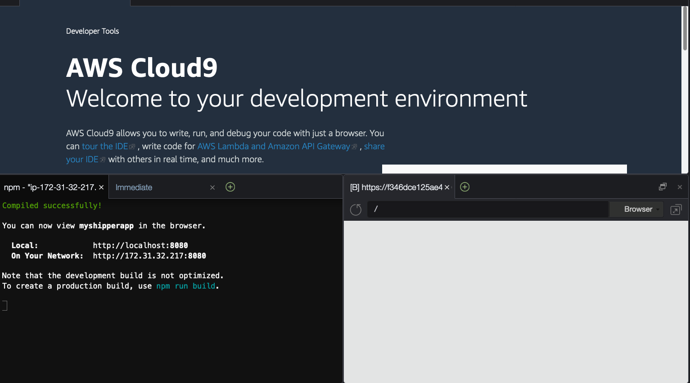

# Building Application using React, Shipper API, AWS Amplify, and Amazon Location Service

Hi everyone, in this tutorial we are going to build a very simple application by using React, 
Shipper API, AWS Amplify, and Amazon Location Service. The application will do a simple API 
call from Shipper API and show in the map.

## 0. Set Up Cloud9 IDE

AWS Cloud9 is a cloud-based integrated development environment (IDE) that lets you write, run, and debug your code with just a browser.
We will use AWS Cloud9 for development to make it easy for us to get standardized environment and easy collaboration.

### 0.1. Set Up Cloud9

**STEP 1** Open .

**STEP 2** Click **Create Environment**.

**STEP 3** Put name for the new Environment, e.g. "ShipperApp". Click **Next Step**.

**STEP 4** Leave all default options. Click **Next Step**.

**STEP 5** In the review page, click **Create environment**.

## 1. Installation

In this step we will do installation of required libraries and components for development.


### 1.1. Install AWS Amplify.

We will assume that we will use Linux-based IDE (e.g. AWS Cloud9).

**STEP 1** Install AWS Amplify using Node Package Manager (NPM).

```bash
npm install -g @aws-amplify/cli
```

To test whether the installation successful, execute the step below.

```bash
amplify --version
```

**STEP 2** Now we need to configure AWS Amplify so that it can access/create AWS resources on our behalf.

```bash
amplify configure
```

**STEP 3** Follow the steps. Starting by accessing AWS console. .

```
Follow these steps to set up access to your AWS account:

Sign in to your AWS administrator account:
https://console.aws.amazon.com/
Press Enter to continue
```

**STEP 4** Choose `us-east-1` for **region** configuration.

**STEP 5** Input username for IAM user, you can leave blank, or you can choose your own, e.g. `amplifyshipper`. After you input, it will show a URL. Follow the URL to create.

**STEP 6** Make sure the IAM panel shows the right username you choose, and "Programmatic Access is checked". Click **Next: Permissions**.

**STEP 7** Make sure the permission is "Administrative Access". Click **Next: Tags**.

**STEP 8** Leave default. Click **Next: Review**.

**STEP 9** Review the choices. Click **Create User**.

**STEP 10** The panel will show Access Key ID and Secret Access Key. Download the CSV.

**STEP 11** Go back to terminal, it will prompt "Enter the access key of the newly created user". Input the access key and secret access key.

**STEP 12** In the profile name, input `shipper`.

## 2. Development

Now we are arrive in the fun part!

### 2.1. Create a fresh React Project.

**STEP 1** To create a new React project, execute the command below. We assume the project name is `myshipperapp`.

```bash
npx create-react-app myshipperapp --template typescript
```

**STEP 2** Let's test the app.

```bash
cd myshipperapp
npm start
```

When you see something like this below, you can open the app in your browser with URL: `https://localhost:8080`.
Or you can also see the preview in Cloud9 by choosing **Preview** > **Preview Running Application**.

```text
Compiled successfully!

You can now view myshipperapp in the browser.

  Local:            http://localhost:8080
  On Your Network:  http://172.31.32.217:8080

Note that the development build is not optimized.
To create a production build, use npm run build.
```

.